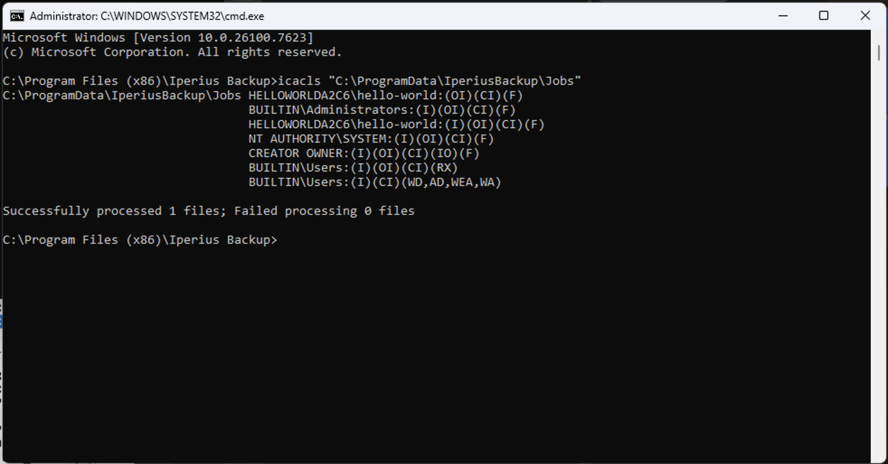
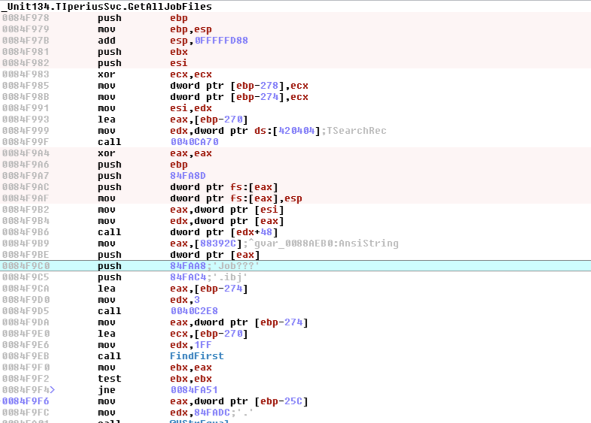
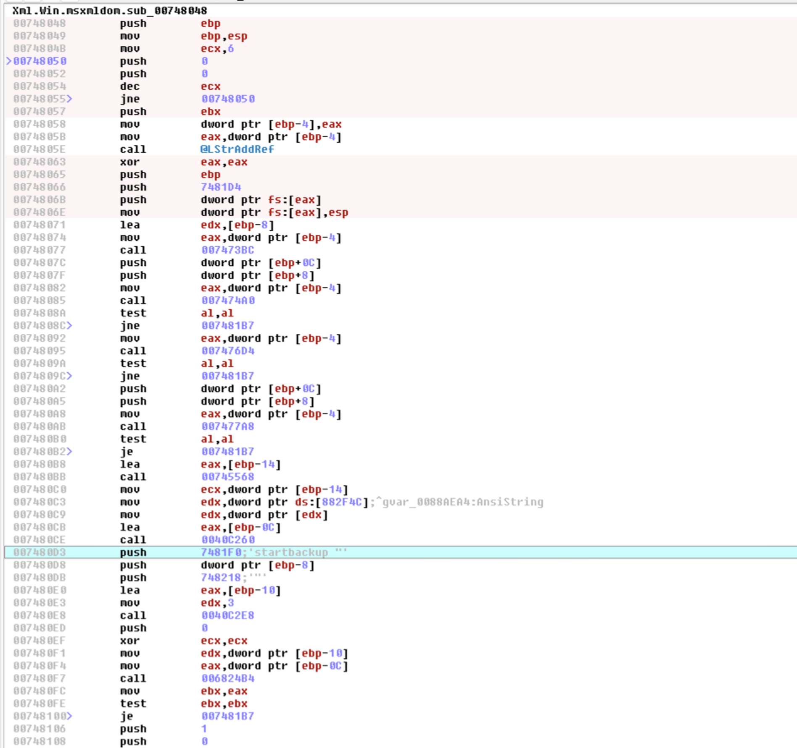
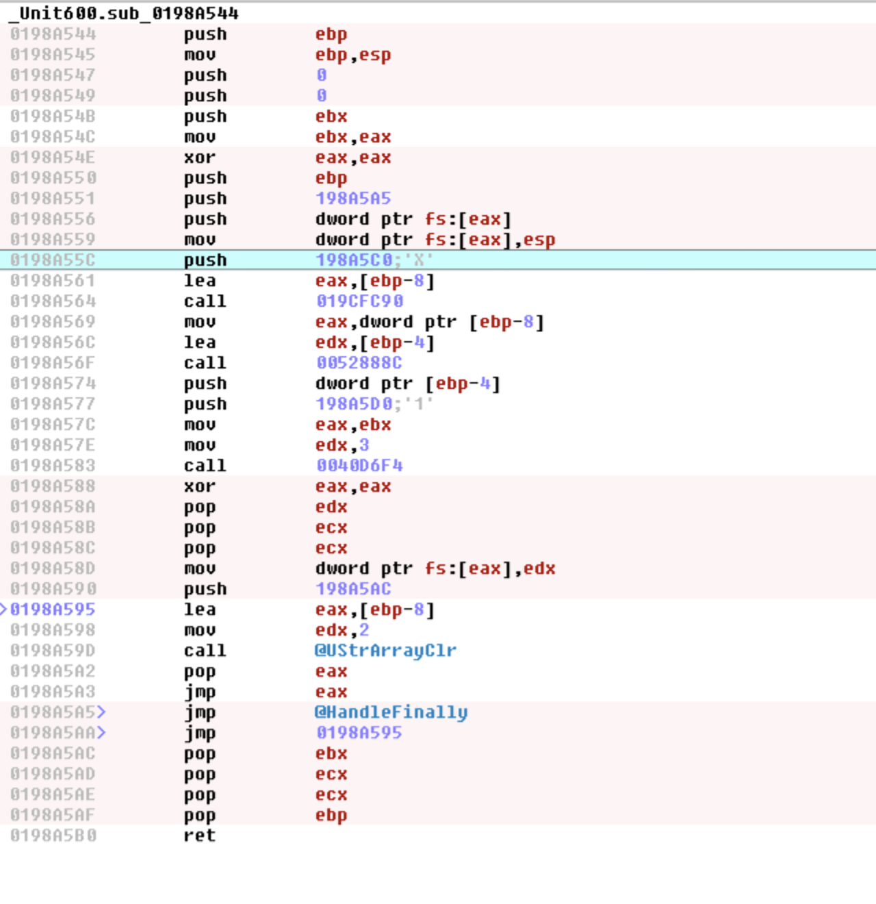
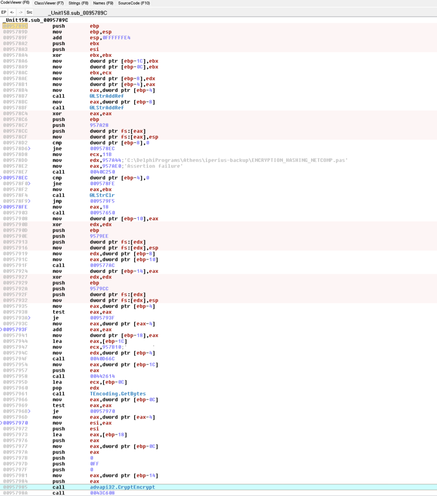
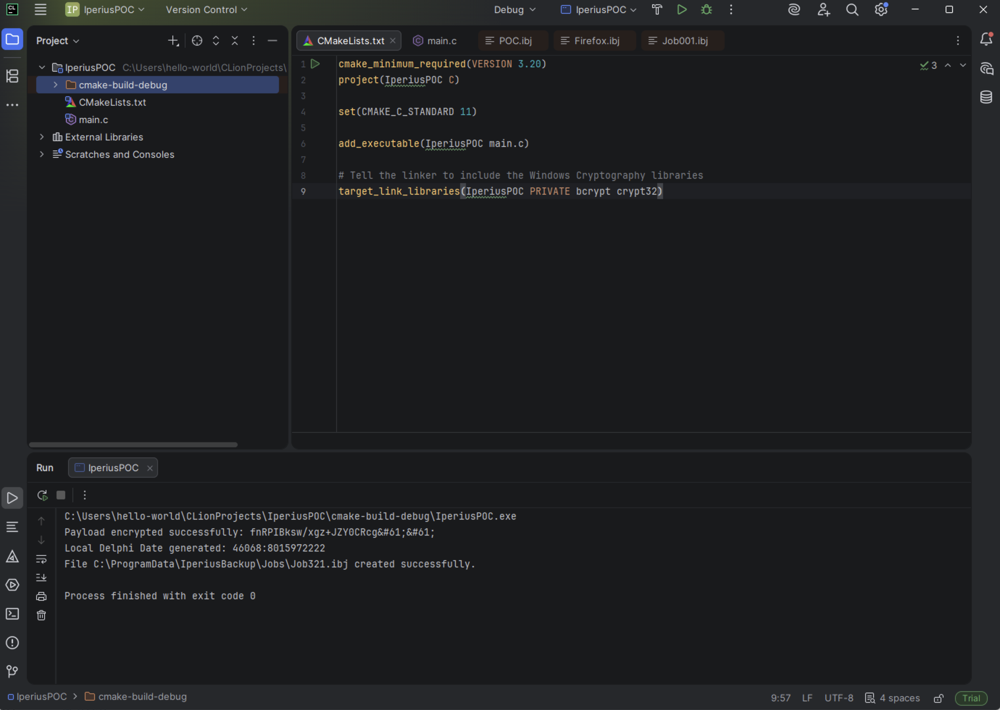
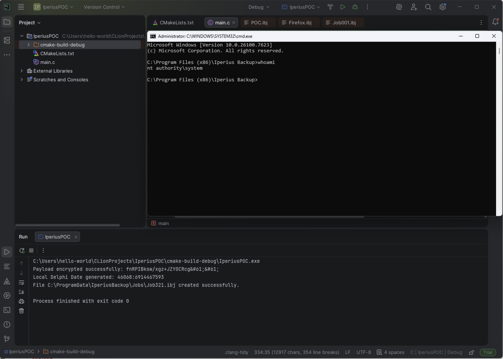

# Privilege Escalation via Encrypted Job File Injection

## Overview

| Field | Details |
|-------|---------|
| **Finding ID** | Privilege Escalation via Encrypted Job File Injection |
| **Severity** | High |
| **CVSS v3.1** | 8.8 (`AV:L/AC:L/PR:L/UI:N/S:C/C:H/I:H/A:H`) |
| **Affected Version** | Iperius Backup v8.7.2 |
| **Attack Vector** | Local |
| **Privileges Required** | Low (any authenticated local user) |

## Description

The Iperius Backup Service runs under the `NT AUTHORITY\SYSTEM` account and automatically monitors the directory `C:\ProgramData\IperiusBackup\Jobs` for backup job configuration files (`.ibj`). This directory has insecure default permissions that grant `BUILTIN\Users` write access, allowing any authenticated local user to create new files.

The application encrypts commands stored in the `PreCommand` field of job files using AES-128 in ECB mode. However, the encryption key is derived from the system's `MachineGuid` registry value (`HKLM\SOFTWARE\Microsoft\Cryptography\MachineGuid`), which is readable by all local users. The key derivation algorithm is deterministic: the GUID string is reversed, prepended with `X` and appended with `1`, then hashed with SHA-256, and the first 16 bytes of the hash are used as the AES-128 key.

By reverse-engineering this encryption scheme, an attacker can craft a fully valid `.ibj` configuration file containing an encrypted arbitrary command in the `PreCommand` field and place it into the Jobs directory. The Iperius Backup Service will automatically load the new job file and execute the decrypted command under the `NT AUTHORITY\SYSTEM` context, resulting in complete local privilege escalation without requiring any GUI interaction or administrative privileges.

While the application provides a GUI interface for configuring pre-backup commands (which also executes under SYSTEM context), this finding demonstrates that the encryption applied to the command field provides no meaningful protection, as the key is derived entirely from publicly accessible data. This enables a fully automated, GUI-less attack.

---

## Evidence

### Step 1: Verifying Folder Permissions

The first step was to confirm that the Jobs directory is writable by a low-privileged user. Using the `icacls` utility, the permissions on the `C:\ProgramData\IperiusBackup\Jobs` directory were inspected:

```
C:\>icacls "C:\ProgramData\IperiusBackup\Jobs"
C:\ProgramData\IperiusBackup\Jobs
    BUILTIN\Administrators:(I)(OI)(CI)(F)
    NT AUTHORITY\SYSTEM:(I)(OI)(CI)(F)
    CREATOR OWNER:(I)(OI)(CI)(IO)(F)
    BUILTIN\Users:(I)(OI)(CI)(RX)
    BUILTIN\Users:(I)(CI)(WD,AD,WEA,WA)
```

The key entry is `BUILTIN\Users:(I)(CI)(WD,AD,WEA,WA)`, which grants all authenticated local users the following permissions:

- **WD** (Write Data) — ability to create files in the directory
- **AD** (Append Data) — ability to append data to files
- **WEA** (Write Extended Attributes) — ability to modify extended file attributes
- **WA** (Write Attributes) — ability to modify file attributes

This confirms that any local user can write new `.ibj` files into the Jobs directory.



### Step 2: Reverse Engineering the Service — Job File Discovery and Execution

Static analysis of the `IperiusSvc.exe` binary was performed to understand the internal logic governing job file processing. The following critical code paths were identified:

#### 2.1 Job File Discovery (`GetAllJobFiles`)

At address `0084F9C0`, the service uses a hardcoded file mask `Job???` to scan the Jobs directory. This means the service will automatically discover and load any file whose name matches `Job` followed by exactly three characters (e.g., `Job321.ibj`), regardless of who created it. No ownership verification, digital signature check, or integrity validation is performed on the files.



#### 2.2 Scheduling Logic — Time-Based Trigger

The service implements two scheduling branches for determining when to execute a job:

- **Standard Scheduling** (`SchedType=1`): The service checks the `WeekDays` field (must contain `1` at the current day's position) and the `Times` field. At address `00747D04`, a string comparison (`call @UStrEqual`) is performed between the current system time (in `HH:MM` format) and the configured execution time. This is a simple string equality check with no authentication or authorization.

- **One-Time Execution** (`RunOnceAsServiceDateTime`): If the `RunOnceAsServiceDateTime` field contains a Delphi TDateTime float value that falls within approximately 1 minute of the current system time, the job is triggered immediately.

#### 2.3 Command Execution

At address `007480D3`, the service constructs a command line argument using the string `startbackup "` followed by the job name. The resulting child process inherits the `NT AUTHORITY\SYSTEM` privileges of the parent service process.



### Step 3: Reverse Engineering the Encryption — Command Obfuscation Bypass

Detailed analysis of the command encryption wrapper function `sub_0198A5D4` revealed the complete encryption chain:

#### 3.1 Key Derivation Function

At address `0198A5FE`, the function calls `sub_0198A544`, which implements the key derivation procedure:

1. Reads the `MachineGuid` value from `HKLM\SOFTWARE\Microsoft\Cryptography`.
2. Reverses the string character-by-character.
3. Prepends the static prefix `X` (visible at address `0198A55C`) and appends the static suffix `1` (at address `0198A577`).
4. The resulting string (e.g., `X{reversed_guid}1`) is hashed using SHA-256.
5. The first 16 bytes of the hash are used as the AES-128 encryption key.



Since the `MachineGuid` registry value is readable by all authenticated local users, and the derivation algorithm is deterministic with hardcoded constants, the encryption key can be reproduced by any local user.

#### 3.2 AES Encryption Routine

At address `0198A60B`, the encryption function `sub_0095789C` is called. This function uses the Windows CryptoAPI (`advapi32.dll`):

- At address `0095791F`: The derived key is imported via the CryptoAPI.
- At address `00957985`: The standard `CryptEncrypt` function is called to perform AES-128-ECB encryption.



**Encryption Parameters (confirmed via reverse engineering):**
- Algorithm: **AES-128**
- Mode: **ECB** (Electronic Codebook — no IV required)
- Padding: **PKCS#7**
- Input encoding: **UTF-16LE**
- Output encoding: **Base64** (with `=` replaced by `&#61;`)

### Step 4: The Proof of Concept

Based on the reverse engineering findings, a Proof of Concept was developed in C that fully automates the attack chain. The PoC performs the following operations:

1. **Reads MachineGuid** from the registry using `RegQueryValueExW`.
2. **Derives the AES-128 key** by reversing the GUID, constructing `X{reversed_guid}1`, hashing with SHA-256 via BCrypt, and taking the first 16 bytes.
3. **Encrypts the payload command** using AES-128 ECB with PKCS#7 padding.
4. **Encodes the ciphertext** in Base64, replacing `=` with `&#61;`.
5. **Generates a complete `.ibj` file** directly into the Jobs directory with all required sections and valid timestamps.

The full source code is available at [`poc/iperius_job_inject.c`](../poc/iperius_job_inject.c).



### Step 5: Automatic Execution by the Service

Upon the next scheduling cycle, the `IperiusSvc.exe` service scans the Jobs directory using the `Job???` mask (as confirmed in Step 2.1), discovers the newly created `Job321.ibj` file, parses its configuration, decrypts the `PreCommand` field using the same MachineGuid-derived key, and executes the decrypted command under the `NT AUTHORITY\SYSTEM` context.

The `RunOnceAsServiceDateTime` field in the `.ibj` file is set to the current Delphi TDateTime value, causing the service to trigger execution within approximately one minute of file creation.

### Step 6: Confirming SYSTEM-Level Execution

After the service processes the malicious job file, the execution of the encrypted command was confirmed. Process analysis revealed the spawned process running under `NT AUTHORITY\SYSTEM` as a child of `IperiusSvc.exe`.



---

## Complete Attack Chain

1. **Read** `MachineGuid` from the registry (accessible to all users);
2. **Derive** the AES-128 key using the reverse-and-hash algorithm;
3. **Encrypt** an arbitrary command with the derived key;
4. **Generate** a valid `.ibj` job file with the encrypted command in `PreCommand`;
5. **Write** the file to `C:\ProgramData\IperiusBackup\Jobs\` (writable by all users);
6. **Wait** for the service to process the file and execute the command as SYSTEM.

---

## Conclusion and Security Assessment

During the penetration testing activities, it was identified that the encryption mechanism applied to backup job commands in Iperius Backup can be fully bypassed by any authenticated local user. The encryption key is derived from the system's `MachineGuid` registry value — a value that is readable by all local users — using a deterministic algorithm (string reversal, concatenation, SHA-256 hash, truncation to 16 bytes). Combined with the insecure default permissions on the `C:\ProgramData\IperiusBackup\Jobs` directory, this allows a low-privileged attacker to craft and deploy malicious job files that execute arbitrary commands under `NT AUTHORITY\SYSTEM`.

The encryption applied to the `PreCommand` field — presumably added as a mitigation measure — provides **no meaningful security benefit**, since the key derivation relies entirely on publicly accessible inputs. The protection is a form of "Security through Obscurity" — the algorithm and all inputs are deterministic, hardcoded, and accessible to any local user. Unlike GUI-based command configuration, this attack is fully automated and requires no user interaction.

From a **MITRE ATT&CK** perspective, the observed behavior aligns with the following techniques:

- **T1059 – Command and Scripting Interpreter** (execution of arbitrary commands via backup job configuration);
- **T1543.003 – Create or Modify System Process: Windows Service** (abuse of a SYSTEM-level service for command execution);
- **T1574 – Hijack Execution Flow** (manipulation of configuration files controlling application behavior);
- **T1053.005 – Scheduled Task/Job: Scheduled Task** (automatic execution through modified scheduling parameters).

In terms of **CWE classification**, the vulnerability relates to:

- **CWE-276 – Incorrect Default Permissions** (the Jobs directory is writable by low-privileged users);
- **CWE-321 – Use of Hard-coded Cryptographic Key** (the encryption key is derived from a publicly readable system value);
- **CWE-250 – Execution with Unnecessary Privileges** (the backup service executes user-controlled commands as SYSTEM);
- **CWE-732 – Incorrect Permission Assignment for Critical Resource** (critical configuration files can be created by unprivileged users).

In a real-world production environment, this weakness could be leveraged to:

- achieve full local privilege escalation from any authenticated user to `NT AUTHORITY\SYSTEM`;
- establish persistent SYSTEM-level access through recurring scheduled execution;
- deploy malware or post-exploitation frameworks with the highest system privileges;
- dump credentials from LSASS, SAM, or Active Directory;
- pivot laterally within the network using the compromised SYSTEM-level access;
- bypass endpoint protection mechanisms that rely on user-context restrictions.

### Remediation

1. **Fix Folder Permissions:** Remove write access for non-administrative users on `C:\ProgramData\IperiusBackup\Jobs\`. Only the SYSTEM account and local Administrators should have write access to this directory.

2. **Fix Key Derivation:** Do not derive encryption keys from publicly readable system values such as `MachineGuid`. Implement machine-bound encryption using Windows DPAPI (`CryptProtectData`) or CNG (`NCryptProtectSecret`) with per-service key protection bound to the LocalSystem SID.

3. **Integrity Validation:** Implement digital signature verification or HMAC-based integrity checks on `.ibj` configuration files to prevent unauthorized modification or injection of job files.

4. **Principle of Least Privilege:** Evaluate whether the backup service truly requires `NT AUTHORITY\SYSTEM` privileges for all operations. Consider running the service under a dedicated service account with minimal permissions.

5. **Command Allowlisting:** Implement validation of `PreCommand` and `PostCommand` values against an administrator-defined allowlist of permitted executables and arguments.
